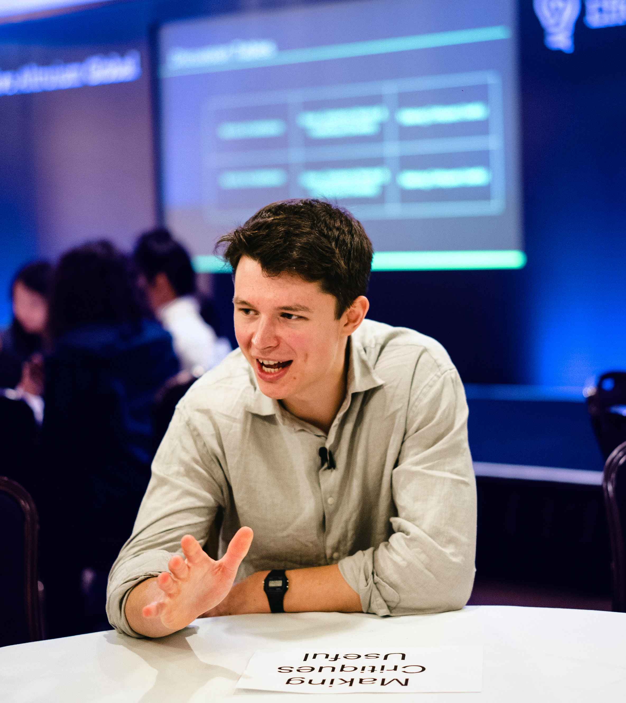

import "../styles/contact.scss"
import Seo from "../components/seo"

<Seo title="👋 About me" pageThumb="/meta-about.jpg" />

<h1 className="page-title">About me</h1>

Right now I'm a Research Scholar and assistant to [Toby Ord](https://en.wikipedia.org/wiki/Toby_Ord) at Oxford University's [Future of Humanity Institute](https://www.fhi.ox.ac.uk/).

I'm interested in [effective altruism](https://www.effectivealtruism.org/), [longtermism](https://www.longtermism.com), and [existential risk](https://www.theprecipice.com). I write about this kind of thing on my [writing](https://www.finmoorhouse.com/writing) page.

Here are some things I'm up to right now:

- I co-host a podcast called [Hear This Idea](https://www.hearthisidea.com), which showcases new thinking in philosophy, the social sciences, and [effective altruism](https://www.effectivealtruism.org/).

- I'm thinking about [some EA project ideas](https://www.finmoorhouse.com/writing/ea-projects) I'd like to help make happen.

- I'm a mentor and panelist for the [Effective Ideas](https://www.effectiveideas.org/) blog prize.

- I've been researching [space governance](https://80000hours.org/problem-profiles/space-governance/) as an EA cause area, and now I'm trying to help get this very early field up and running.

- I helped [set up a contest](https://forum.effectivealtruism.org/posts/8hvmvrgcxJJ2pYR4X/announcing-a-contest-ea-criticism-and-red-teaming) to support EA criticism. You should apply!

- Some other things you should ask me about in person!

Before this, I interned with [Charity Entrepreneurship](https://www.charityentrepreneurship.com/), and helped [Liv Boeree](https://en.wikipedia.org/wiki/Liv_Boeree) make [videos](https://youtu.be/kM7J56OxA6w). Before _that_, I did philosophy at Cambridge.

In my free time I [read](http://www.goodreads.com/finm), listen to [music](https://rateyourmusic.com/collection/finm/r0.5-5.0,ss.rd), and play chess [badly](https://lichess.org/@/finjm).

And here is a picture of me:

