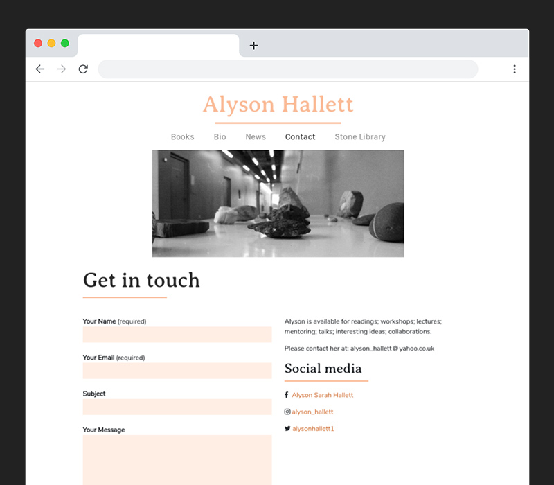
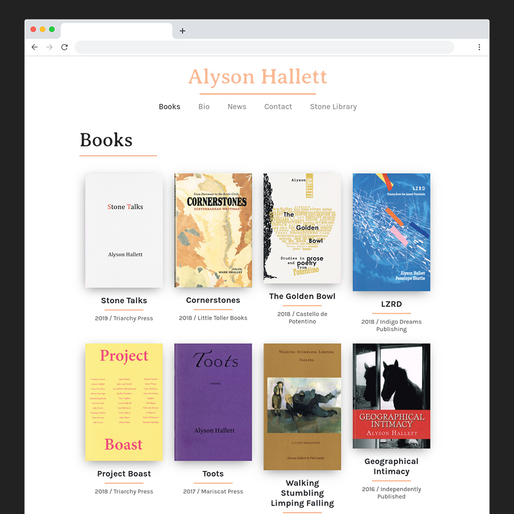
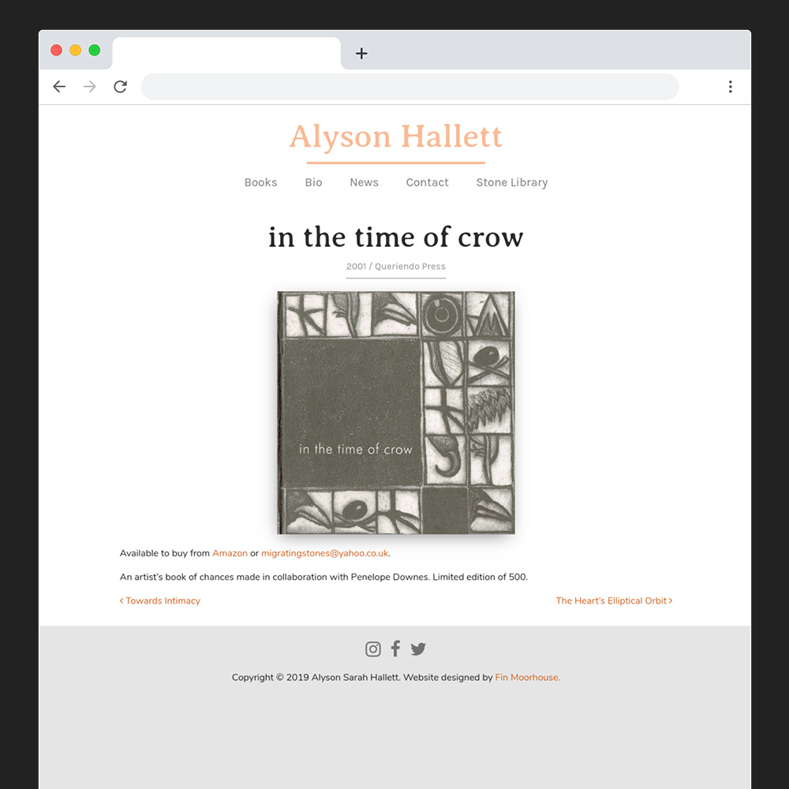
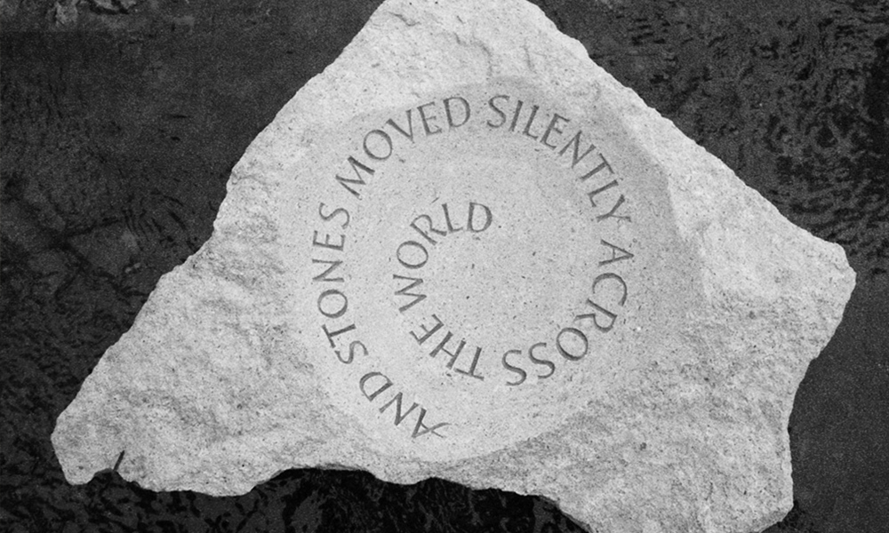

Click <a href="https://www.alysonhallett.com" target="blank">here</a> to see the site.

Alyson Hallett is a prize-winning poet and writer who lives in Somerset. Her publications include sole-authored and co-authored books of poetry, collections of short stories as well as drama, an audio diary and an essay commissioned for BBC radio. She frequently collaborates with sculptors, dancers, glass makers, visual artists, musicians, and has received Arts Council funding for her poetry and public art project, The Migration Habits of Stones.

I was briefed with making a personal website where Alyson could list her books and publications, promote her work, and post news and writing. The end result was to be as simple as possible, and the back-end easy to use.

I built the site in WordPress, making it wasy to add books and news. All the book covers are scanned images of an original copy of each book.

Some interesting trivia: the header font is _Averia_, which is the result of taking the average of every font that comes with most computers.

