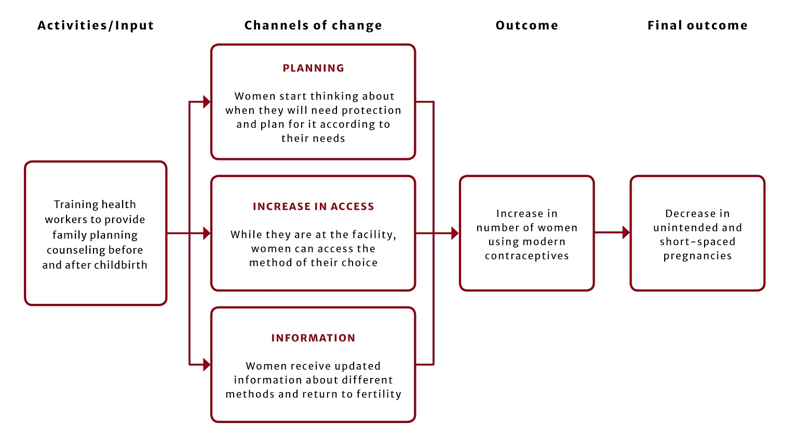

Charity Entrepreneurship is a is an effective altruist organization that helps start multiple high-impact charities annually based on extensive research. Like a startup incubator for nonprofits. Unlike for-profit incubators, however, they also spend *thousands* of hours ever year researching the most promising ideas for charities which do not yet exist (see [this year's recommendations](https://www.charityentrepreneurship.com/charity-ideas.html) for illustration). They then run an incubation program for participants who have the greatest chance of starting new charities from that list; also providing seed grants, legal support, and ongoing mentorship. Past charities started by Charity Entrepreneurship include the [Happier Lives Institute](https://www.happierlivesinstitute.org/), [Good Policies](https://forum.effectivealtruism.org/posts/igjJ3LrgrfWNm5Zzq/introducing-good-policies-a-new-charity-promoting-behaviour), [Animal Advocacy Careers](https://www.animaladvocacycareers.org/), [P.E.N](https://www.policyentrepreneurs.org/index.html), [Suvita](https://www.suvita.org/), and the [Fish Welfare Initiative](https://www.fishwelfareinitiative.org/).

I joined CE for Summer 2020 as their data visualisation intern. I wore lots of hats throughout the internship. This included visualisations for research reports, editing videos for the incubation program, producing videos for social media with motion graphics, formatting reports, creating t-shirt designs, and designing the covers of an upcoming book for publication.

Here's one of the videos I made:

<iframe width="560" height="315" src="https://www.youtube.com/embed/2DC25RBzsQM" frameborder="0" allow="accelerometer; autoplay; clipboard-write; encrypted-media; gyroscope; picture-in-picture" allowfullscreen></iframe>

Below are some example images from all of the above.

## Data Visualisation

## Videos

## Design

