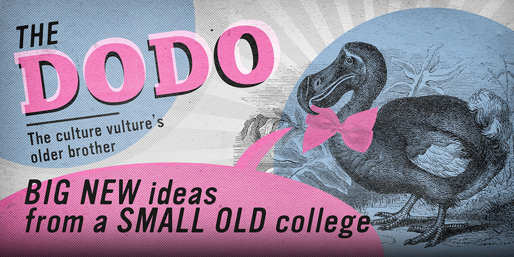
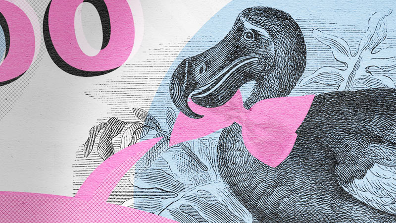

_The Dodo_ is the student magazine for Peterhouse college, Cambridge. It was recently resurrected after a hiatus, and I designed the new look for its relaunch. This included a banner, logo, and print design for the magazine itself.

I also wrote an <a href="https://medium.com/@finlaymoorhouse/orwell-against-perfection-bcf7aaad33d0" target="blank">article</a> about Orwell's essay <a href="https://www.orwellfoundation.com/the-orwell-foundation/orwell/essays-and-other-works/can-socialists-be-happy/" target='blank'>'Can Socialists Be Happy?'</a>, and made an image of a fractal to be featured in the first edition. The fractal is a <a href="https://en.wikipedia.org/wiki/Julia_set" target="blank">Julia set</a> generated with Python.

