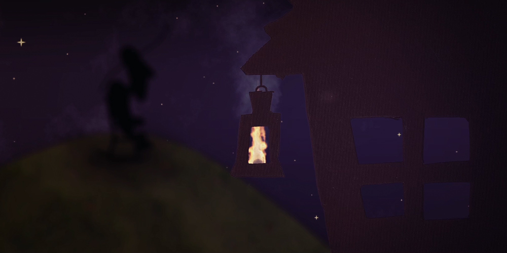
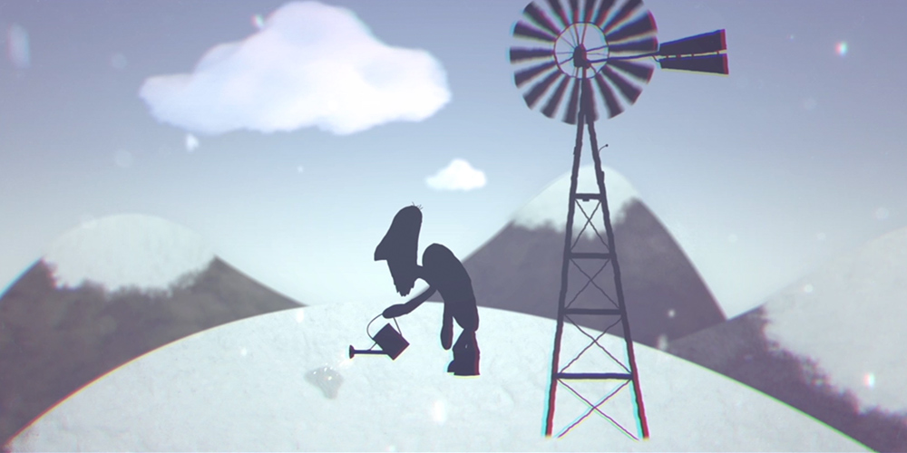
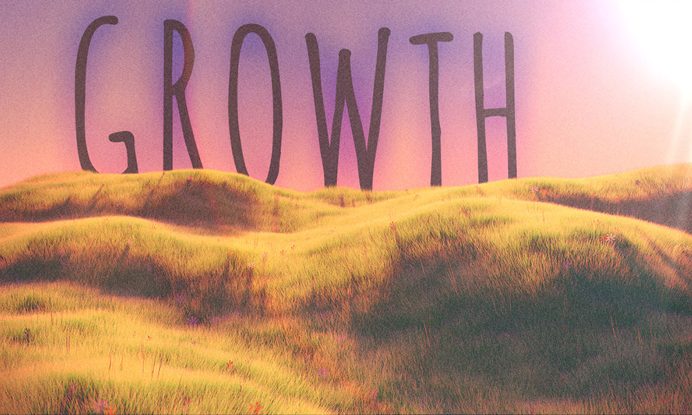

_Growth_ is a short animation about a farmer who grows a corn maze. The landscapes of the films were made through a mix of photography, paper cut-outs, and 3D models. For instance, the farmer himself and his house were cut out of card and digitally scanned,and the fields of grass and wheat were modelled and animated in <a href="https://www.blender.org/" target="blank">Blender</a>. I was 14 years old when I made it and I would hve done some things differently today. Still, I'm still quite proud of it.

