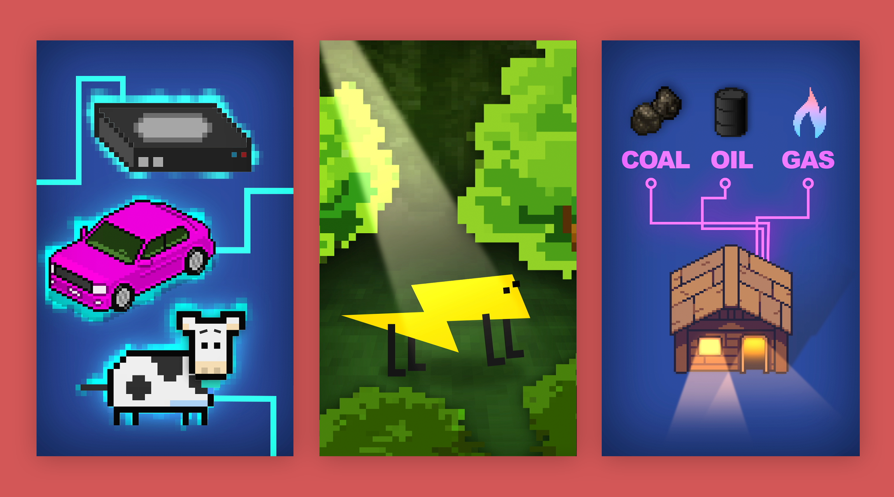
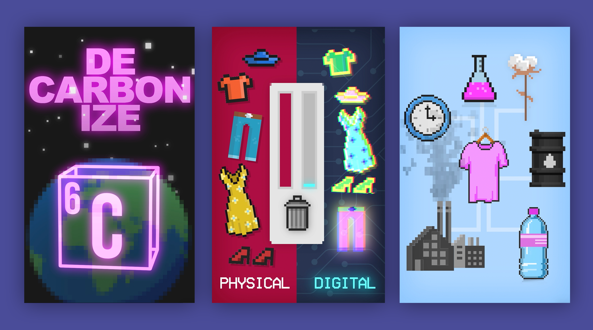
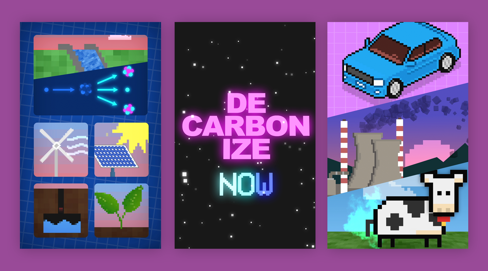

[Isodope](https://i-sodope.com/) is the project of [Isabelle Boemeke](https://twitter.com/isaboemeke), a fashion model from Brazil.

Long story short: it looks like nuclear power should be playing a very important role in decarbonising the world's sources of useful energy. It's clean, robust to changes in weather, *remarkably* safe, and space-efficient. Yet, its potential benefits far outstrip its reputation. Ask almost anyone what they think about nuclear power, and you'll conjure up images of glowing green radiation and a certain HBO miniseries. As far as I can tell, this skepticism is basically an unfortunate hangover from some historical contingencies in early environmentalism. In other words, it can be fixed. Since energy policy is [responsive to public sentiment](https://en.wikipedia.org/wiki/1980_Swedish_nuclear_power_referendum), this *really* matters.

Experts do speak out, but their voices don't tend to reach very far. And when people listen, it's hard to really get *excited* or *passionate* listening to an academic talk about power stations.

Isabelle saw all this, and decided to do something. She started posting weird, fun, videos for her existing audiences on social media. They have titles like '[in which I talk about the density of uranium](https://twitter.com/isaboemeke/status/1302617328140640256)', in which she talks about the density of uranium. Did you know a gummy bear-size uranium pellet can power a house for more than 2 months? The goal is to get a new generation — a generation of TikTok and Twitter users who aren't *necessarily* being proactive about researching energy policy — excited and clued-up about nuclear power. And, so far, it seems to be working. Isabelle has probably changed more minds and got more people talking about nuclear energy than basically any academic I can think of in the last few years.

I think this is so cool and inspiring, and I was very happy to get a chance to help Isabelle with some animations, which featured on videos about [decarbonisation](https://twitter.com/isaboemeke/status/1333455921566023680) and the fashion industry. Below are some screenshots.

## More Links

- [TikTok](https://www.tiktok.com/@realisabelleboemeke)
- [Instagram](https://www.instagram.com/isabelleboemeke/)
- [Isodope: a radical new voice for nuclear](https://energyforhumanity.org/en/top-ten-facts/isodope-a-radical-new-voice-for-nuclear/)
- [TikTok Influencer ‘Isodope’ Is Stanning for Nuclear Energy](https://www.vice.com/en/article/y3gg3k/tiktok-influencer-isodope-is-stanning-for-nuclear-energy)
- [This radiant model wants you to stop worrying and love nuclear energy](https://grist.org/energy/this-radiant-model-wants-you-to-stop-worrying-and-love-nuclear-energy/)

