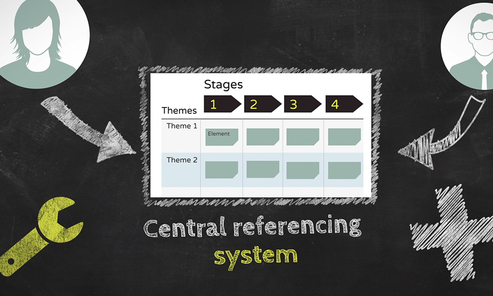

Method Grid is a SaaS startup for building, sharing and organising processes in a grid.

I produced a series of animated 'explainer' videos to introduce the concept, and the problem it solves. I also edited some testimonial videos and recorded and edited some podcast episodes.

You can learn more about Method Grid <a href="https://methodgrid.com/" target="blank">here</a>, or watch the introduction video <a href="https://www.youtube.com/watch?v=sDztuuTiBH4">here</a>.

