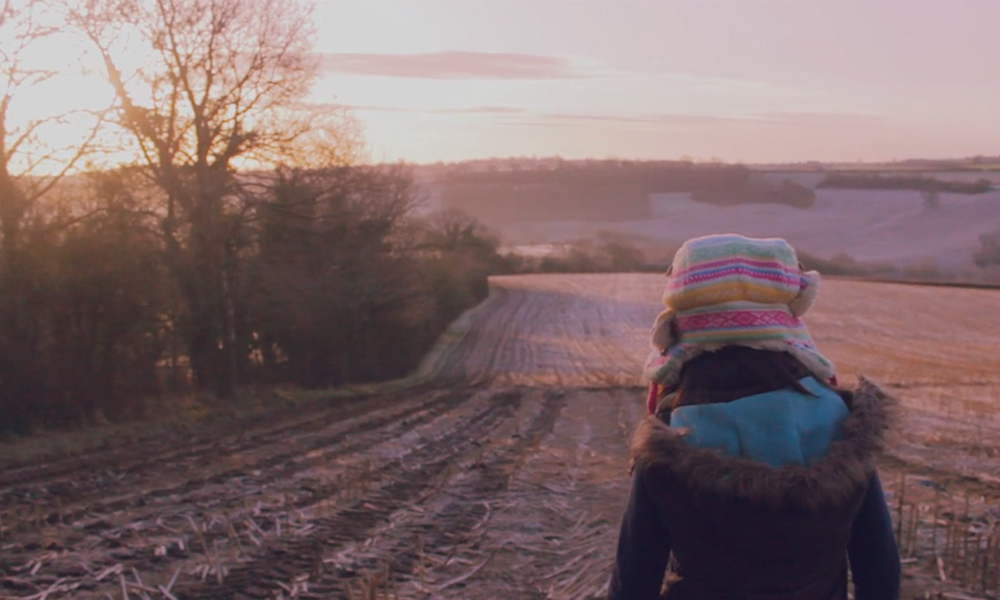
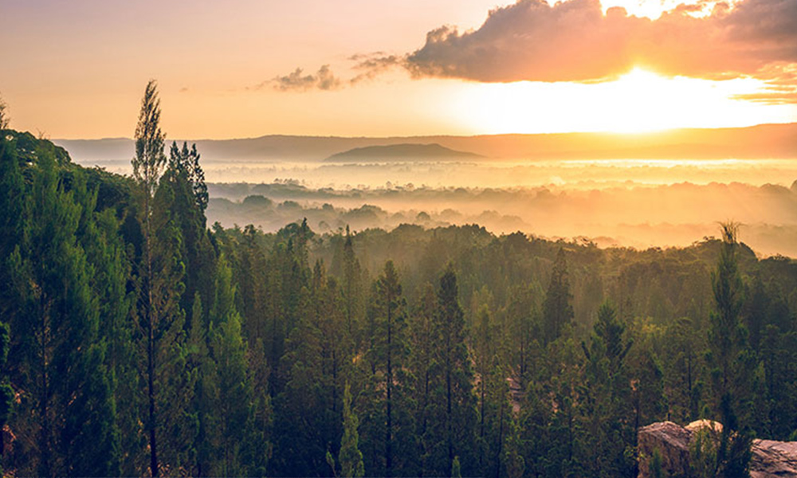
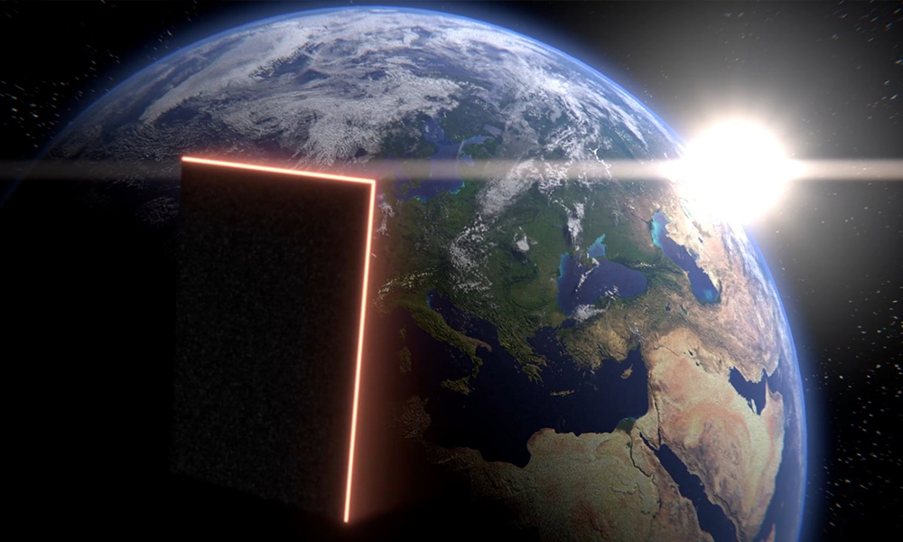

In 2015 I was given the opportunity to produce three films for a live orchestral accompaniment, to be projected during a concert in the historic Bath Assembly Rooms. Composer Mark David Boden scored the music and handed the result to me to work from.

The first film uses footage from a trip to Kenya; it is a condensed version of a longer film I made about the trip. The second is a short wordless film following my little sister as she wakes up early to take a photo of the sunrise. The third is an animation about a man who, dissatisfied with his work, opens his office door to a series of new worlds.

You can read about the performance <a href="https://www.bathecho.co.uk/news/education/king-edwards-students-wow-audience-bath-200-gala-concert-66261/" target="blank">here</a>, and you can watch the first and second movements <a href="https://vimeo.com/finmoorhouse/a113" target="blank">here</a> and <a href="https://vimeo.com/finmoorhouse/morning">here</a>.

