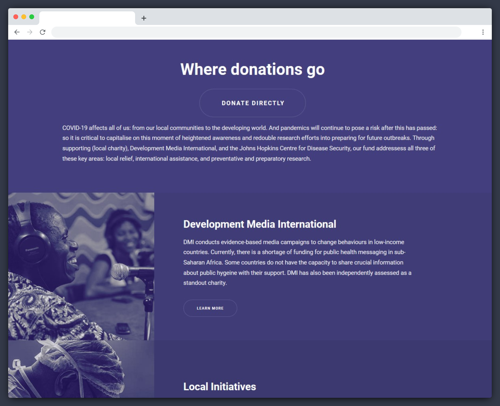

Shortly after the coronavirus outbreak, a friend of mind had an idea for a charitable initiative that encouraged event organising platforms to include a clear option to donate some part of a refund to effective charities responding to the virus in the developing world, or working on mitigating future biological risks. The idea was inspired by the psychological effect, a close cousin of the sunk cost fallacy, where unexpected refunds are more liberally spent or donated during the period while they are still treated as windfall. Since the project was time-critical, it required a website to be designed and built rapidly (i.e. within 48 hours). Having been involved with developing the idea, I took on the brief and designed [refundraising.org](https://refundraising.org/).

Shortly aftwerwards, the ‘refundraising’ idea merged with [cancelcorona.org](https://cancelcorona.org/), who added a [page](https://cancelcorona.org/refunds/) addressing refunds to their (wonderful) website. I’ve let the original website stand– not as an example of a polished finished product, but as an example of the kind of proof of concept which can be achieved in a day or two.

 

