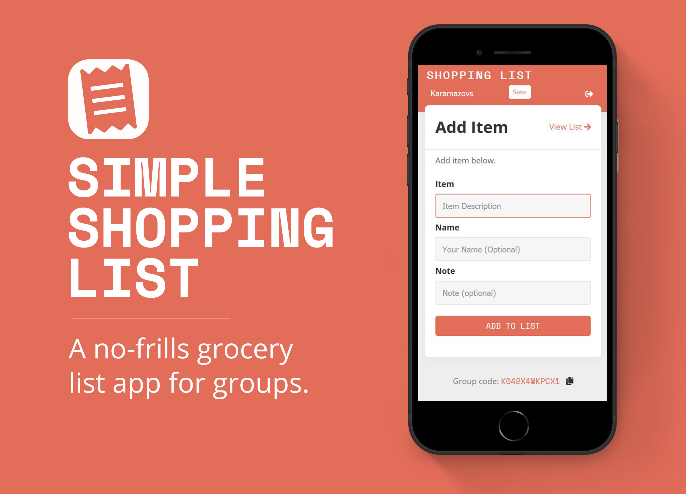
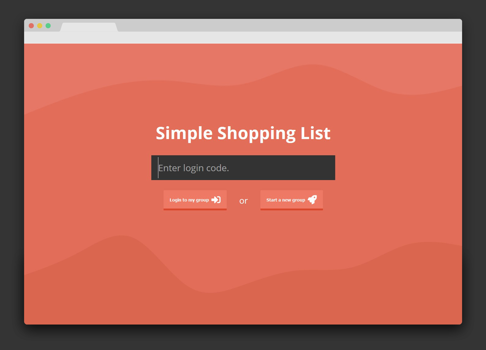
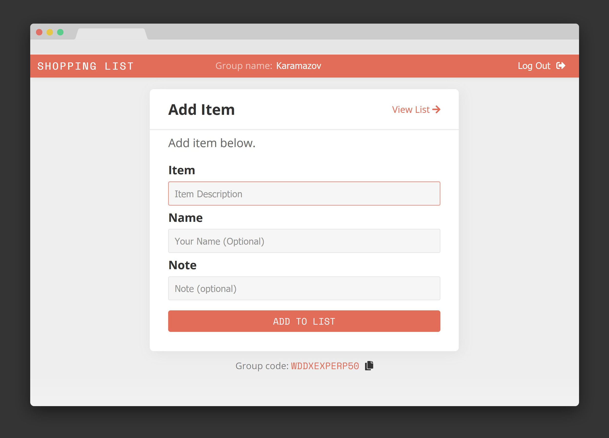
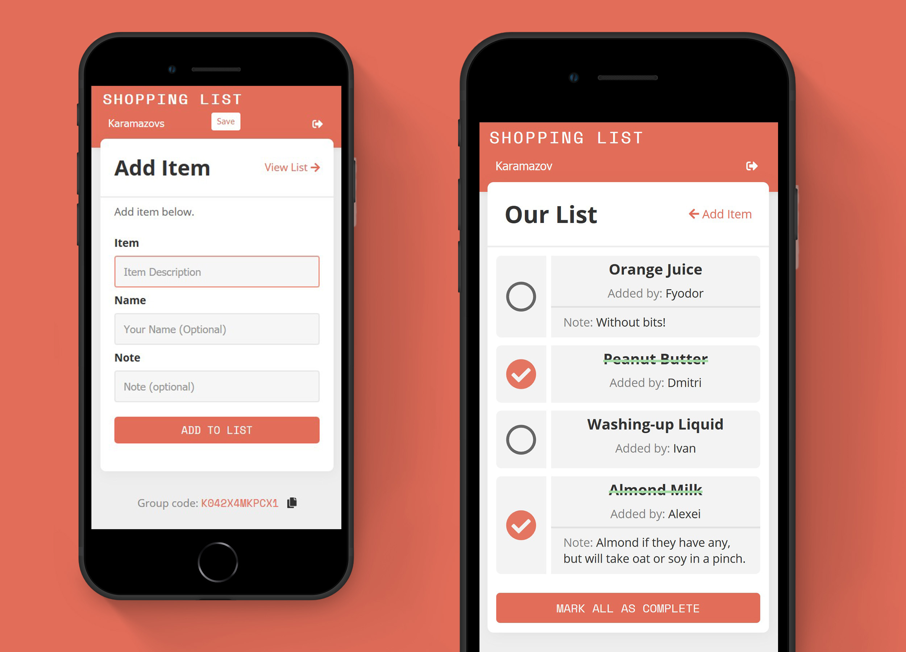
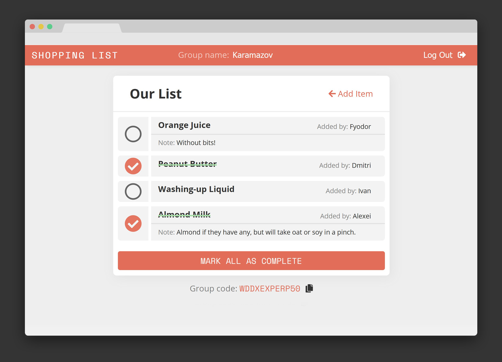

I recently started in earnest to try learning full-stack web development — that is, interactive web apps and the technologies that power them. This long road began with a [course](https://www.udemy.com/course/react-2nd-edition/) on using [React](https://reactjs.org/), a JavaScript library for building user interfaces. 50+ hours later, I was ready to remove the stabilisers and try my hand at a self-guided project.

In my household (and many others by projection) we coordinate our grocery and shopping lists by writing on and transcribing from scraps of paper, phone notes, text messages, and a little whiteboard on the fridge. Items got forgotten or mistaken all the time. Here, I thought, was an opportunity to make things easier: a dead simple web app where everyone in the family (modulo the dog) could ping their shopping list requests into one list; which could then get marked as ‘complete’ and recycled for the next big shop.

You can [check it out here](https://fin-shopping-list.herokuapp.com/). Fair warning: I haven’t paid for decent hosting, so expect it to take in the order of 10 seconds to fire up on first load. You will also notice I haven’t paid for a domain name either. When you first login, you can either generate a code (start a new group) or paste in an existing group’s code to join it. Then you can start adding to your heart’s content, and view the entire list on your next shop.

**Things I haven’t yet done: ** please note that the level of security here is about as minimal as it gets. I decided to use single randomly generated group codes over username / password combinations for simplicity of use — but the trade-off is that it may be possible to stumble on / guess other group’s codes. On the other hand, you’re a fool to store highly sensitive information in a grocery list. I also cut corners on testing—something I intend to correct in my next project—which means edge cases and funky inputs might easily break the thing, or else fail to behave properly. 

I used [React](https://reactjs.org/), [Redux](https://redux.js.org/introduction/getting-started), [Webpack](https://webpack.js.org/), React-Router, and [Firebase](https://firebase.google.com/). I didn’t end up using a CSS framework of any kind, in order to grasp what it takes to make an MVP app like this look passable and useable without shortcuts.

I learned a lot of lessons making this. Not least, I better appreciate [Hofstadter’s Law](https://en.wikipedia.org/wiki/Hofstadter%27s_law):

> It always takes longer than you expect, even when you take into account Hofstadter's Law.

