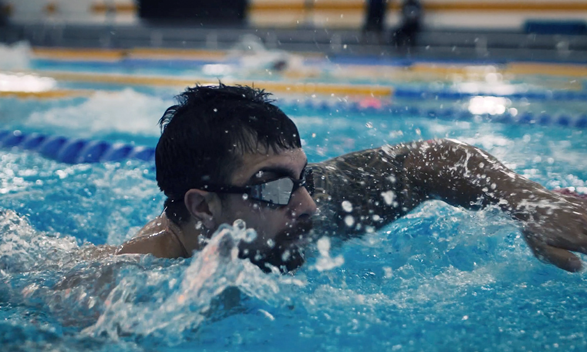
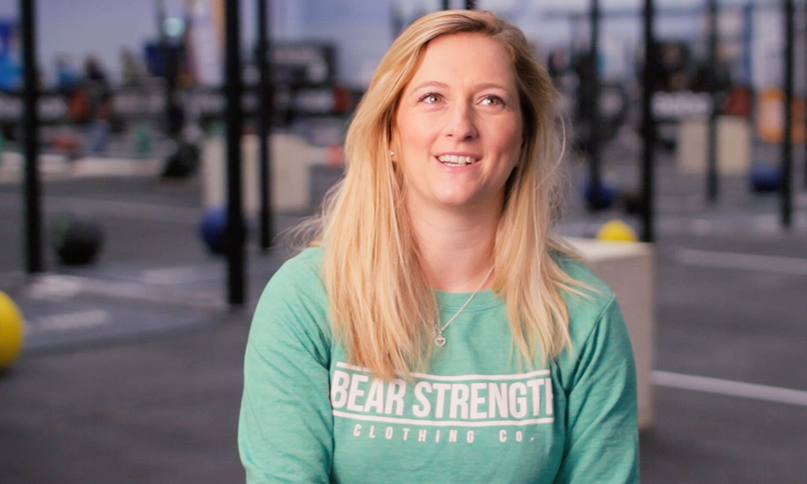

SiD (<a href="https://strengthindepth.com" target="blank">Strength in Depth</a>) is a series of 'fitness racing' competitions across the UK, and part of the European Fitness League. It is the UK's official CrossFit® Sanctional event, the first stage of the worldwide CrossFit® Games in the USA.

I have filmed a number of Strength in Depth and Inferno Racing events over the past 5 or so years. Typically, there might be half a dozen heats in a day, and I will shoot and edit them on the fly so that a highlight reel for each heat can get released a few hours after each heat. It's fast-paced and the turnaround times are very tight, but I really enjoy it.

Beyond the events themselves, I have filmed 'movement standards' videos, interviewed atheletes, made promotional films for partner vendors, and produced animated reveal films.

You can watch some of the videos on the <a href="https://www.youtube.com/channel/UCV9LKEdWKq4R2WG_-oVbjbQ/videos" target="blank">YouTube</a> channel, although not all of them are mine. <a href="https://www.youtube.com/watch?v=aTZjUBEhdDg" target="blank">Here's</a> an example of a promotional clip.

