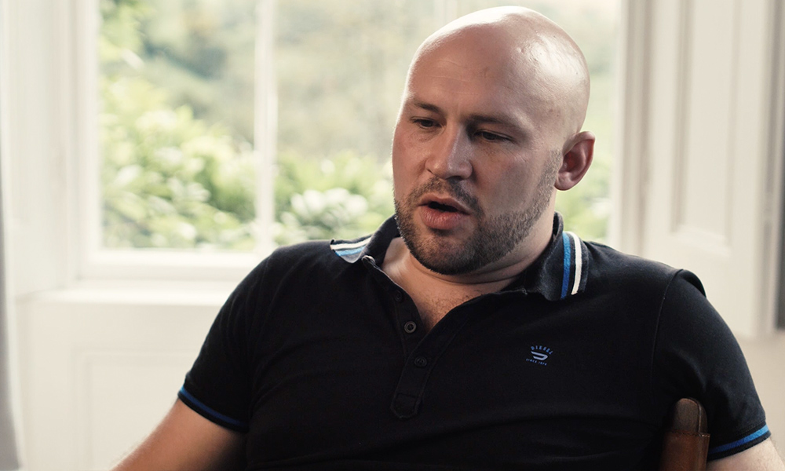
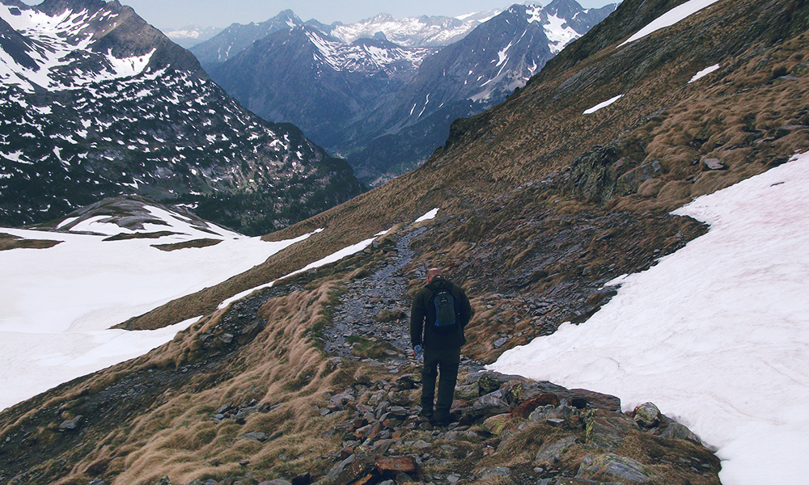

The Mountain Way was founded by Andy Shaw, a retired Royal Marine and veteran of the Falkands and Northern Ireland conflicts. Andy suffered from PTSD for 30 years before he was able to overcome his “silent wound”. He now takes military veterans suffering from PTSD on 10-day, one-to-one trips in the French Pyrenees with the aim of resolving their own condition.

Stuart came to The Mountain Way having in the aftermath of an IED incident in Afghanistan. His time with Andy was miraculously effective, and he was able to return to his family stronger and more optimistic.

I was approached by the Mountain Way to help tell Stu's story. During the interview, he described his experiences in Northern Ireland and Afghanistan, and subsequent struggles with PTSD and attempts at getting help. We were all very grateful to be able to share his story and the Mountain Way cause.

The films themselves were broken into six sub-sections, centring on a talking-head interview with Stuart, and images from his trip.

  All the videos can be found{" "}
  <a
    href="https://www.youtube.com/playlist?list=PLbCQ-eLK9qR2ClXKRGrymiCVXNkZtV8eO"
    target="blank"
  >
    here
  </a>
  .

