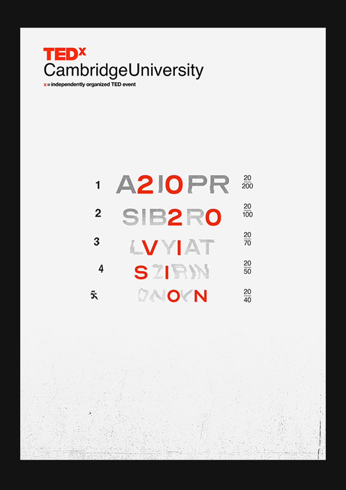

I joined the graphic design team for the <a href="http://www.tedxcambridgeuniversity.org/" target="blank">TEDx conference</a> at the University of Cambridge. Collaborating with the video and design teams, I produced mockup posters for the main theme and two smaller 'salons'. Using the image we settled on, I made a short 'theme reveal' video with clips from previous speakers and an animated version of the poster.

The video and designs were made with of Photoshop, After Effects, and Blender. See below a mockup I made for a poster on the theme of 'Revolution', which I submitted in applying for the role. Below that are some further designs for the actual theme, and a screenshot from the video.

