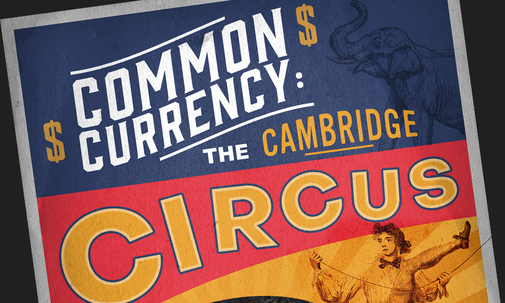

The Cambridge Union is the oldest continuously running debating society in the world. I was invited to join the committee in the role of graphic designer over the summer of 2019. During that time, I made banners, posters, and images for social media; helping to shape a more inclusive and accessible online brand of the Union.

Highlights for me were the announcement poster for Bill Gates' scheduled appearance, and the full-page ad for the Tab newspaper.

