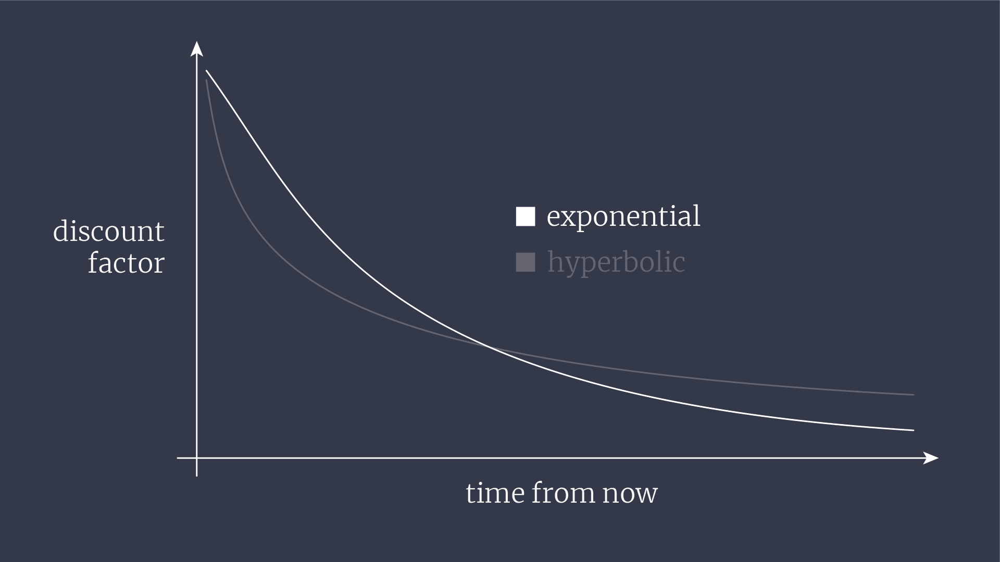
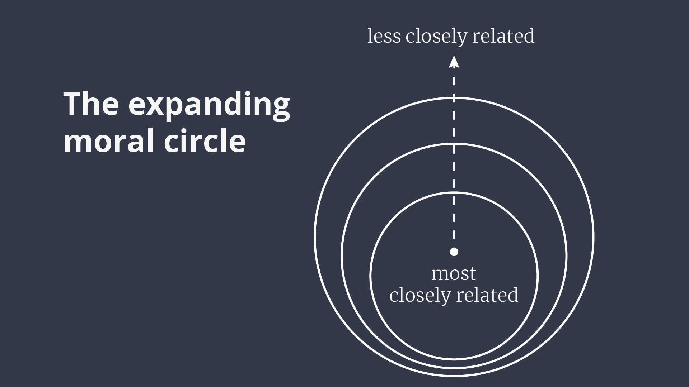
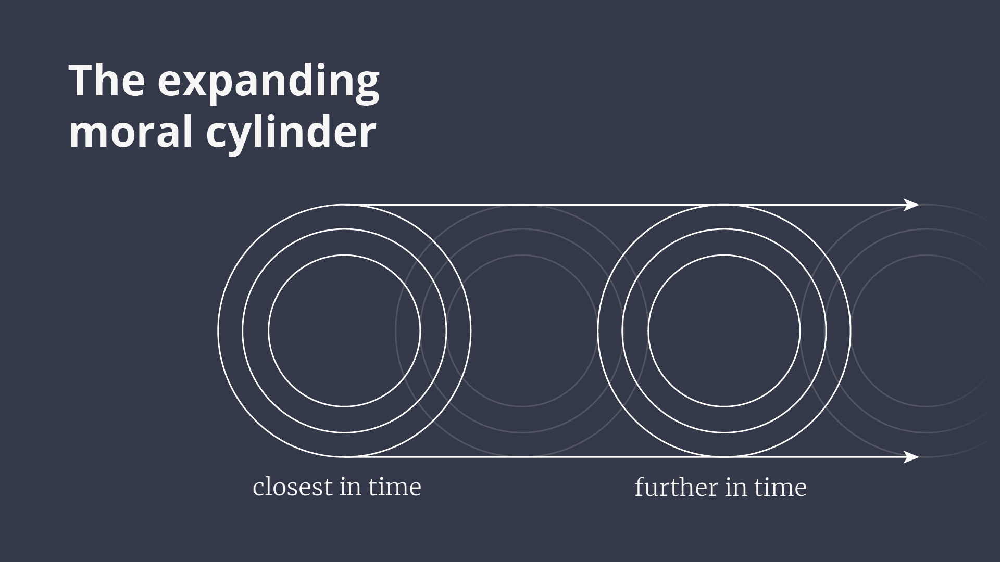
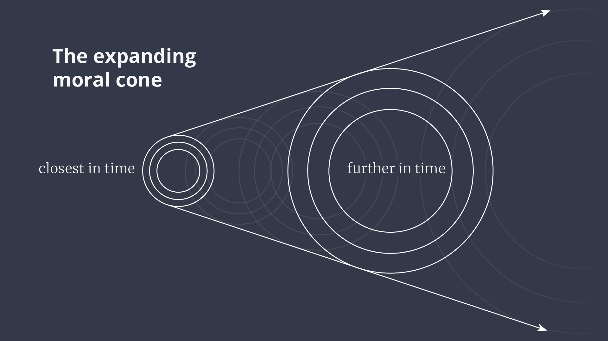

---

title: Intro to Longtermism
slug: longtermism
author: Fin Moorhouse
path: /writing/longtermism
type: post
subtype: ea
canonicalUrl: www.effectivealtruism.org/articles/longtermism/
date: 2021-01-26
featuredImage: './longtermism.jpg'
---

'Longtermism' refers to a set of ethical views concerned about protecting and improving the long-run future. Although concern for the long-run future is not a new idea, only recently has a serious intellectual project emerged around it — asking whether it is legitimate, and what it implies.

Can we plausibly influence the very long-run future? If so, how important is it that we do what we can to improve its prospects? To these questions, an increasing number of apparently sensible people are answering: "yes we can, and very". If we decide or discover that there are things we can do to improve the very far future, that doing so is extremely important, and that we're not currently taking those opportunities — then longtermism would turn out to matter a great deal.

You might also want to learn more about longtermism because it could end up influencing decision-making, whether or not it's true or important. If you're into effective altruism, you might be alarmed by how many philanthropic dollars are already being diverted to sci-fi sounding longtermist interventions of dubious intuitive value; especially when urgent and pressing problems like extreme poverty and factory farming remain tractable, neglected, and important.

The plan for this post is to introduce some definitions, defences, and criticisms of longtermism.

## Definition(s)

Some 'isms' are precise enough to admit of a single, undisputed, definition. Others, like feminism or environmentalism, are broad enough to accommodate many (often partially conflicting) definitions. It's unlikely that any precise or detailed definition will end up sticking for 'longtermism', so the question is whether it should have some *minimal* definition, or none at all.

There's clearly *some* common core to varieties of longtermism deserving of the name — just as there's something shared among varieties of feminism. As mentioned, that sentiment is something like *a serious ethical concern with protecting and improving the long-run future.* Here, the 'long-run future' is taken to mean something like the period from now through to thousands of years out, or (much) more.

Some proponents of longtermism prefer a minimal definition. The philosopher Will MacAskill [suggests](https://forum.effectivealtruism.org/posts/qZyshHCNkjs3TvSem/longtermism) the following —

> Longtermism is the view that: (i) Those who live at future times matter just as much, morally, as those who live today; (ii) Society currently privileges those who live today above those who will live in the future; and (iii) We should take action to rectify that, and help ensure the long-run future goes well.

This means that longtermism would become false if society ever ended up becoming biased towards the interests of future, rather than present, people.

Other suggested minimal definitions don't depend on facts about society. Hilary Greaves suggests something like —

> [T]he view that the (intrinsic) value of an outcome is the same no matter what time it occurs.

If that were true today, it would be true always.

## The case for longtermism

For this section, let's take longtermism to be the view that —

> A major determinant of the value of our actions is how they affect the very long-run future. Surprisingly often, this means that the among the best actions open to us are some of the relatively few actions which can be expected to improve the long-run future.

The most popular argument for longtermism in the (tiny) extant philosophical literature is consequentialist in flavour, and has roughly three parts. First, there is an observation that the goodness or badness of some outcome doesn't depend on when it happens. Second, there's an empirical claim that the future could plausibly be very big and valuable indeed. Third, there are things we can do today with a decent shot at influencing that future by a not-ridiculously-small amount and with a not-ridiculously-small chance. Putting these together, the conclusion is that there are things we can do today with a decent shot at making an enormously valuable difference.

Let's go through these stages.

### Future effects matter just as much

Longtermists claim that, all else equal, (far) future effects matter intrinsically just as much as more immediate effects. There are plenty of practical reasons to prefer making things go well right now versus trying to make things go well 1,000 years from now. The most obvious is that it's far, far easier to reliably affect how things go in the immediate future, and it's normally totally unclear how to reliably affect how things go in the much longer-run. After all, we know about today's pressing problems, but what will the world's pressing problems be a few centuries from now? That's anyone's guess. Another reason is that benefits often compound, meaning the best way of improving how things go in the (far) future is often to improve how they're going right now.  Money gives the clearest example. Should I do something with my $1,000 now — like give it to charity or invest it — or should I bury the money and dig it up a few centuries from now? Burying the money would be like torching almost all its value. Similarly, suppose I have some medicine which treats a tropical disease. Immediate benefits are often instrumentally useful for future benefits. Should I distribute it now, or should I use it a few decades or centuries from now? Using the medicine now would not only help improve people's lives now, it might also help the region in which you use it develop, making those people less likely to need help in the future. Finally, some things we can do now would be much less valuable to do much later, because they depend on circumstances which are likely to change.

Longtermism isn't denying any of that, because of the 'all else equal' part. The idea is more like: suppose you can confer some fixed total amount of harms or benefits right now, or in $N$ years, where $N$ is a big number. Since all else is equal, there are no knock-on effects, and you're equally confident you can confer these harms or benefits at either time. Is there something about conferring those harms or benefits in the (far) future which makes them *intrinsically* less (dis)valuable? In other words, might we be prepared to sacrifice less to avoid the same amount of harm if we were confident it would occur in the (far) future, rather than next year? Longtermism answers 'no'.

On reflection, the mere fact that something happens far away from us in *space* doesn't make it less intrinsically bad than if it happened nearer to us. And people who live far away from us aren't worth less by dint of that fact. This realisation is part of a family of views called [cosmopolitanism](https://plato.stanford.edu/entries/cosmopolitanism/). Longtermism draws an analogy from space to time. It's useful to think of the universe as a 'block', extruded along a temporal dimension. If there's no good reason to think that things matter less as they become more spatially distant, why think things matter less if they occur further out in time? In this way, we should also embrace 'temporal cosmopolitanism' too.

There are two broad kinds of reason for denying that the value of an outcome is the same no matter when it occurs. One reason is that we might want to 'discount' the intrinsic value of future welfare, and other things that matter. In fact, governments do employ such a 'social discount rate' when they do cost-benefit analyses. Another kind of reason appeals to the fact that outcomes in the future affect people who don't exist today. I'll tackle the first kind now and the second, thornier, kind in the 'objections' section.

### Discounting

I think it's fair to say that discounting the intrinsic value of outcomes over time is not sensible. No serious philosophers have defended such a rate, as far as I know. The reason governments employ a social discount rate is likely more a matter of electoral politics than deep ethical reflection. Voters prefer to see slightly smaller benefits soon compared to slightly larger benefits a long time from now. Plausibly, this gives governments a good democratic reason to employ a discount rate. But the question of whether governments should respond to this public opinion is separate from the question of whether that opinion is right.

Here's an example from Parfit (1984). Suppose you bury some glass in a forest. In one case, a child steps on the glass in 10 years' time, and hurts themselves. In the other case, a child steps on the glass in 110 years' time, and hurts themself just as much. If we discounted welfare by 5% every year, we would have to think that the second case is over 100 times less bad than the first — which it obviously isn't. Since discounting is exponential, this shows that even a modest-seeming annual discount rate implies wildly implausible differences in intrinsic value over large enough timescales. Applying even a 3% discount rate over 500 years implies that outcomes now are more than 2 million times more intrinsically valuable than outcomes then.

To see how ridiculous this is, consider how a decision-maker from the past would have weighed *our* interests in applying such a discount rate. Does it sound right that a despotic ruler from the year 1500 could have justified some slow ecological disaster on the grounds that we matter much less than his contemporaries?

One pedantic, but optimistic, point is that while humans do tend to discount future goods, they don't tend to discount them exponentially. Instead, people tend to discount *hyperbolically —* where the discount rate they apply is inconsistent over time. Over short time horizons, we discount steeply. Over long time horizons, we discount less steeply. For instance, many people would prefer £20 now to £30 one month from now, but few people would prefer £20 one year from now to £30 a year and a month from now.

If you're interested in the maths, here's an example of exponential discounting:

$$f(D)=e^{-kD}$$

And an example of hyperbolic discounting:

$$f(D)=\frac{1}{1+kD}$$

Where $f(D)$ is the discount factor, and $D$ is the time until the reward.

I say this is an optimistic point because it means that most people think (or at least behave as if) some constant discount rate is less and less reasonable the further out it is projected. In other words, people are more inclined to care about the very long-run future relative to the not-so-long-run future than such a constant rate implies.

### The long-run future could be enormously valuable

By 'future', we mean '*our* future' — our descendants and the lives they lead. You could use the phrase 'humanity's future', but note that by humanity we don't mean the species *Homo sapiens.* We're interested in how big and valuable the future could be, and then we'll ask whether we might have some say over that value. Neither of those things depends on the species membership of our descendants.

How valuable could our future be? To begin with, a typical mammalian species survives for an average 500,000 years. Since *Homo sapiens* have been around for about 300,000 years, then we might expect to have about 200,000 years left — if *Homo sapiens* were a typical mammalian species, and we had nothing else to go on. Of course, neither condition is true. For instance, humans make up about [100 times](https://www.goodreads.com/book/show/12918295-the-social-conquest-of-earth) the biomass of any large wild animal that has ever lived. But it's a start.

It might also be instructive to look to the [future of the Earth](https://en.wikipedia.org/wiki/Future_of_Earth). Assuming we don't somehow change things, it looks like our planet will remain habitable for about [another billion years](https://www.researchgate.net/publication/253770007_Long-term_Astrophysical_Processes) (before it gets sterilised by the sun). If there were a 1% chance that humanity survived that long, and similar numbers of people lived per-century as in the recent past, then we should expect at least a *quadrillion* future human lives.

Perhaps more importantly, humanity might spread beyond Earth. We might settle other planets, or even construct vast life-sustaining [structures](https://www.bbc.com/future/article/20210113-the-megascale-structures-that-humans-could-one-day-build). Certainly this is permitted by the laws of physics, and those [who have investigated](https://www.fhi.ox.ac.uk/will-we-eventually-be-able-to-colonize-other-stars-notes-from-a-preliminary-review/) the feasibility of space colonisation seem to think that it would be practically feasible. If humanity does spread beyond Earth, it could spread unimaginably far and wide. And since we would become dispersed over huge stretches of space, we would plausibly become less vulnerable to one-shot existential catastrophes. The numbers of stars in the affectable universe, and years over which we may be able to harness their energy, are literally astronomical.

But precise numbers shouldn't be taken too seriously, and [nor should extrapolating](https://en.wikipedia.org/wiki/The_Poverty_of_Historicism) from past trends like 'humans per century'. What matters is to elicit some appreciation of the enormous potential — even plausible — size of our future. Metaphors do the same thing in a more creative way. Greaves and MacAskill analogise humanity's story to a book-length tale, and note that we may well be on the very first page. This makes sense — about [100 billion](https://www.prb.org/howmanypeoplehaveeverlivedonearth/) humans have ever been born on Earth, and we've just seen that at least a thousand times as many might yet be born. Here's one from Roman Krznaric's book *[The Good Ancestor](https://www.romankrznaric.com/good-ancestor)*: if the distance from your face to your outstretched hand represents the age of the earth, one stroke of a nail file would erase human history. However, my favourite framing belongs to physicist [James Jeans](https://en.wikipedia.org/wiki/James_Jeans). Imagine a postage stamp on a single coin. If the thickness of the coin and stamp combined represents our lifetime as a species, then the thickness of the stamp alone represents the extent of human civilisation. Now imagine placing the coin atop a 20-metre tall obelisk. If the stamp represents the entire sweep of human civilisation, the obelisk represents the age of the Earth. We might extend this metaphor beyond the present. A 5-metre tall tree on the postage stamp represents the Earth's habitable future. Behind this arrangement, the height of the Matterhorn mountain represents the [habitable future of the universe](https://en.wikipedia.org/wiki/Timeline_of_the_far_future).

The future could also be full of things that matter. If all goes well, it could be exceptionally valuable. To begin with, technological progress could continue to eliminate scarcity and improve material conditions. [Arguably](https://waitbutwhy.com/table/1700s-monarch-vs-modern-person), it would be better to have been born into a middle-class American family in the 1980s than to be born as the king of France around the year 1700. Looking forward, we might expect opportunities and capabilities available to a baby born in the further future which a present-day billionaire can only *wish* to have. Beyond quality of life, you might also care intrinsically about works of art, the reach of justice, or the pursuit of truth and knowledge for their own sakes. All of these things could flourish and multiply beyond levels they have ever reached before.

Again — nobody is claiming to know what humanity's future, or even its most likely future, will be. At least, people who do are kidding themselves. What matters is that the future could very plausibly be enormously large, and full of things that matter.

### We can do things to significantly and reliably affect that future

What makes the enormous potential of our future *morally* significant is the possibility that we might be able to influence it. There is a trivial sense in which almost anything we do affects the far future, of course. Things we do now cause future events. Those events become causes of further events, and so on. And small causes sometimes amount to tipping points for effects much more significant than the immediate or intended effect of your initial action. As such, the effects of things you do now ripple forward unpredictably and chaotically. The far future is just the result of all those ripples we send into the future.

The *mere* fact that our actions affect the far future is poetic but not itself important. What would matter is if we can do so *reliably.*

Suppose you're deciding whether to help an old lady across the road. The short-term effects are clear enough: if you do, you'll both be better-off. If you don't, you'll feel regretful and the old lady would be worse-off too. But wait — choosing to help the old lady could hold up traffic and lead to a future dictator being conceived later this evening! The reason this consideration doesn't weigh *against* helping the old lady is that symmetrical considerations cut the other way — *not* helping the old lady could just as easily play a role in precipitating some future catastrophe. Since you don't have any reason to believe either outcome is more likely for either option, these worries 'cancel' or 'wash out'.

Not all ways of reliably affecting the long-run future are enough to motivate the view that those actions are really important. That's because some such actions trade off reliability at the cost of insignificance. You could carve your initials in a strong stone, or bury a time capsule. In the first case, your stone might be spotted by many people, but none of these people are likely to care much. In the second case, your time capsule might be discovered far in the future, but its discovery would amount to a single event isolated in time, rather than persisting over it. But outcomes are surely not *more* intrinsically valuable the further out in time they occur.

What *would* matter enormously is if we could identify some actions we could take now which could reliably influence how the future plays out over the long run. One class of actions might involve effects which persist, or even compound, across time, in a marginal or incremental way. Another class might help tip the balance from a a much worse to a much better 'attractor' state — some civilisational outcome which is comparatively easy to fall into and comparatively difficult to leave.

The clearest example of such an 'attractor' state is an 'existential catastrophe' — a permanent curtailment of humanity's potential. The most salient kind of existential catastrophe is extinction. We know it's possible — not least because we can witness the extinction of other animal species in real-time. Often, we even help cause those extinctions. Human extinction might have a natural cause, like an asteroid collision. It might also be caused by human inventions — through an engineered pandemic, unaligned artificial intelligence, or even some as-yet unforeseen technology. Other than extinction, we could also end up in some global Orwellian surveillance state, from which escape is nearly impossible. Might there be anything we can do to reliably decrease the likelihood of some of these outcomes? It doesn't seem ridiculous to think there *is*.

We might, for instance, build an asteroid defence system, conduct technical research in artificial intelligence, and strengthen the political infrastructure that regulates experimentation on dangerous artificial human pathogens. Few of us are in a place to do that work directly, but almost all of us are in a position to encourage such initiatives with our voices and our wallets.

What about changes which improve the future more incrementally? Some surprising econometric evidence suggests that regional differences in cultural attitudes sometimes persist for centuries. For instance, [Shulz et al. (2019)](https://science.sciencemag.org/content/366/6466/eaau5141) find that the spread of the Catholic church in Europe during the Middle Ages is associated with a breakdown in kin-based institutions and encouraged a nuclear family structure. These effects are felt as individual differences in more than a dozen psychological outcomes in the present day. In his book *[The Weirdest People in the World](https://www.goodreads.com/book/show/51710349-the-weirdest-people-in-the-world)*, Joseph Henrich suggests that the spread of the Protestant church explained why the industrial revolution occurred in Europe, in turn explaining much of Europe's subsequent cultural and economic dominance. [Alesina et al. (2013)](http://economics.mit.edu/files/6674) also find evidence suggesting that centuries-old differences in farming tools survive as present-day differences in gender norms. In particular, societies which traditionally used ploughs instead of hoes have less equal gender norms, and less "female participation in the workplace, politics, and entrepreneurial activities". Of course, it is one thing to notice these causal differences *ex post*, and another thing to guess what changes now could have similar effects in the far future. But it's encouraging to learn that this kind of long-run cultural persistence is apparently very real.

Improvements in our collective wisdom might plausibly beget *further* improvements through virtuous feedback loops, or bootstrapping processes. This would make things we do now to cultivate those institutions or norms even more valuable. Historically, societies reached a kind of 'liftoff' once their food production methods could sustain a decent number of people doing things other than making sure there's enough food. These people had more freedom to dream up new technologies for producing food, which freed up more people to develop new technology, and so on. In [1800](https://www.digitalhistory.uh.edu/disp_textbook.cfm?smtID=11&psid=3837), more than 80% of the American labor force worked in agriculture. By 1900, the figure had dropped to 40%, and in 2015 [it was 1.4%](https://ourworldindata.org/grapher/share-of-agriculture-in-total-employment?country=~USA). Small differences in exponential growth rates make for small differences in the short-term, and incredible differences in the long-run. Here is [Tyler Cowen](https://www.goodreads.com/en/book/show/31283667):

> [R]edo U.S. history, but assume the country’s economy had grown one percentage point less each year between 1870 and 1990. In that scenario, the United States of 1990 would be no richer than the Mexico of 1990.

As Albert Einstein probably [never said](https://quoteinvestigator.com/2011/10/31/compound-interest/), compound interest really is is the most powerful force in the universe.

### Putting it together

Plausibly, there are some things we can do to reliably and significantly influence how the future turns out over long timescales. Granting this, what makes these things so *valuable* or *important*? On this argument, the answer is straightforward: the future is such a vast repository of potential value, that anything we can do now to improve or protect it by a small fraction could end up being   proportionally valuable. Consider existential risk. If the future would have been good at all, then permanently curtailing the far future would make it 100% worse than it could have been. But, realistically, some fixed amount of effort or money is going to make an existential catastrophe only a little bit less likely, both in absolute and relative terms (that is, relative to the original risk). What makes those efforts so important is the size of the stakes — such that decreasing the chance of losing everything by even a small amount remains hugely important.

In the incremental 'trajectory change' case, the small fraction is roughly the improvement in how things go *per* some period of time, and *per* some fixed number of people. Even when incremental improvements don't compound over time, most people agree that modest improvements can add up to very important differences, given enough of them. As such, some change which improves how each decade goes by some fraction could be enormously important if it persists through hundreds of decades. The case is even stronger when we consider improvements which compound over time, as discussed.

In both cases, actions which reliably and lastingly influence the future derive their importance from multiplying an apparently modest number (a slightly lower probability of extinction, or a fractional improvement in how well things go per period) by a potentially vast number: how much value the future might very well contain.

One way to see why such actions could be so important is to consider an analogy to the prudential case — swapping out the entire future for your future, and only considering what would make your life go best. Suppose that one day you learned that your ageing process had stopped. Maybe scientists identified the gene for ageing, and found that your ageing gene was missing. This amounts to learning that you now have much more control over how long you live than previously, because there's no longer a process imposed on you from outside that puts a guaranteed ceiling on your lifespan. If you die in the next few centuries, it'll most likely be due to an avoidable, and likely self-imposed, accident. What should you do?

To begin with, you might try a bit harder to avoid those avoidable risks to your life. If previously you had adopted a laissez faire attitude to wearing seatbelts and helmets, now could be time to reconsider. You might also being to spend more time and resources on things which compound their benefits over the long-run. If you'd been putting off investing because of the hassle, you now have a much stronger reason to get round to it. 5% returns for 30 years multiplies your original investment just over fourfold. 5% returns for 1,000 years works out at a significantly more attractive multiplier of more than 1,000,000,000,000,000,000,000. If keeping up your smoking habit is likely to lead to lingering lung problems which are very hard or costly to cure, you might care much more about kicking that habit soon. And you might begin to care more about 'meta' skills, like learning how to learn. While previously such skills seemed frivolous, now it's clear there's time for them to pay dividends. Finally, you might want to set up checks against some slide into madness, boredom, or destructive behaviour which living so long could make more likely. So you think carefully about your closest-held values, and write them down as a guide. You draw up plans for quickly kicking an addiction before it's too late.

When you learned that your future could contain far more value than you originally thought, certain behaviours and actions became far more important than you thought. Yet, most of those behaviours were sensible things to do anyway. Far from diminishing their importance, this fact should only underline them. The analogy to our collective predicament should be clear.

Lastly, note that you needn't believe that the future is likely to be overwhelmingly good, or good at all, to care about actions that improve its trajectory. Just the same thought about today's actions persisting or compounding through time, and adding up to very significant positive differences, applies even if you expected the long-run future to be bad overall. If anything, you might think that it's *more* important to reach out a helping hand to future people living difficult lives, than to improve the lives of future people who are already well-off.

For instance, some people think that unchecked climate change could eventually make life worse for most people than it is today. Recognising the size of that diminished future only provides an additional reason to care about doing something now to make climate change less bad.

Finally, note that longtermism is normally understood as a claim about what kind of actions happen to be incredibly good or important *at the current margin*. What makes these actions stand to do so much good is largely the fact that so little effort has so far been made to improve or safeguard the long-run future in a targeted way. Suppose every member or your tribe will go terribly thirsty without water tonight, but one trip to the river to fetch water will be enough for everyone. Fetching water should be a priority for your tribe, but only while nobody has bothered to fetch it. It shouldn't be a priority in the sense that everyone should make it a priority to go off and fetch water. And once somebody brings water, it wouldn't make sense to keep prioritising it. Similarly, longtermism is rarely understood as an absolute claim to the effect that things would go best if all or even most people started worrying about the long-run effects of their actions. All but the most minimal versions of longtermism therefore become less important as a greater fraction of the world's resources are applied in light of it.

## Neglectedness

In order to make a difference on a problem, it's not enough that the problem be important and solvable — because some people might already be solving it. Therefore, the claim that there exist opportunities for (plausibly) making an enormous difference with respect to the future suggests that we've not yet filled those opportunities. In fact, this is an understatement — there are reasons for thinking these actions are outstandingly neglected. This makes those actions seem even more worthwhile, since the most important opportunities are typically filled first, followed by slightly costlier actions, and so on. For instance, the philosopher Toby Ord estimates that bioweapons, including engineered pandemics, pose a greater existential risk by an order of magnitude than the combined risk from nuclear war, runaway climate change, asteroids, supervolcanoes, and naturally arising pandemics. The [Biological Weapons Convention](https://en.wikipedia.org/wiki/Biological_Weapons_Convention) is the international body responsible for the continued prohibition of these bioweapons — and its annual budget is less than that of the average MacDonald's.

If actions aimed at improving or safeguarding the long-run future are so important, why expect them to be so neglected? The main reason is that future people don't have a voice, because they don't presently exist. It isn't possible to cry out so loud that your voice reaches back into the past. That matters because it's often necessary to enfranchise a group before their interests are recognised in collective decisions. When women were gradually enfranchised across most of the world, policies and laws were enacted that made women better off. And women were able to earn their vote in the first place by making themselves heard — through protests and writing. Short of the vote, it matters that some group is able to complain at all. On these lines, we should expect the interests of animals to be highly neglected, because they can't talk at all, nor organise themselves into protest movements. And the same is true of future people.

Think about Peter Singer's picture of the 'expanding moral circle'. In part, it's an empirical observation about the past, and in part it's a guiding principle for the future. On this picture, human society has come to recognise the interests of progressively widening circles. Here's the crude, picture-book version: at first, even the thought of bringing assistance to a rival tribe was off the radar. With the invention of the nation state, sympathies extended to one's compatriots — even beyond one's ethnic group. Some people now restrict their diets to avoid harms to nonhuman animals, out of concern for their interests too. We've come far — refusing to hunt animals out of concern for their feelings would have baffled hunter-gatherers whose moral circle extended as far as their small band. Yet, expanding the circle to include today's nonhuman animals doesn't mark the last possible stage, if none of these concentric circles contain the long-run future.

Maybe the future is contained implicitly in those existing depictions. But why not make such an important feature *explicit*? One way would be to add an extra ring, and label it something like 'future beings'.

What about adding an extra spatial dimension: the *expanding moral cylinder*?

For that matter, in order to indicate a potentially growing population over time — why not the *expanding moral cone*?

Another, related, explanation for the neglectedness of future people has to do with externalities. If all decision makers are more or less self-interested, they're only going to be prepared to do things which accrue more benefits than they cost to enact. Think about this at the level of a country. For some spending, e.g. on schools and infrastructure, it's easy to make sure that the benefits mostly remain in your country — just don't randomly build roads outside your borders. For other projects, it's harder to contain the benefits to your country. One example is spending on research, because the world gets to learn the results, and so other countries benefit from the efforts of your country's scientists. Because the benefits are shared but the costs are confined to you, your share of the total benefit might be less than the share of the benefits you can expect to get, even if the *total* ('social') benefit far outweighs the ('private') cost to you. This is called a 'positive externality'. The reverse can happen just as easily, where the costs are distributed but the benefits confined. This is a 'negative externality'. The paradigm example is pollution and emissions. Our country's emissions impose burdens on the entire world, but we only bear a small fraction of the total burden. If there's nothing in place to stop us, it might be worth it from a self-interested perspective to pollute, even if the total costs far outweigh the total benefits.

The externalities from actions which stand to influence the long-run future not only extend to people living in other countries, but also to people living in the future who are not alive today. As such, the positive externalities from improvements to the very long-run are enormous, and so are the negative externalities from ratcheting up threats to the entire potential of humanity. Modelling governments as roughly self-interested decision makers looking after their presently existing citizens, it would therefore be no surprise if they neglected long-term actions, even if their total benefits stood to *massively* outweigh their total costs. Such actions are public goods par excellence.

## Going Further

### Other framings

Above, I've laid out the main, broadly consequentialist, argument for longtermism. In short: the future holds a vast amount of potential, and there are (plausibly) things we can do now to improve or safeguard that future. Given its size, even small proportional changes to how well the future goes could amount to enormous total changes. Further, we should expect some of the best such opportunities to remain open, because improving the long-run future is a public good, and because future people are disenfranchised. Because of the enormous difference such actions can make, they would be very good things to do. Note that you don't need to be a consequentialist to buy that long-term oriented actions are very good things to do, as long as you care about consequences at all. And any non-insane ethical view should care about consequences to some degree.

That said, there are other ways of framing longtermism. One argument for mitigating existential risk in particular invokes obligations to tradition and the past. Our forebears made sacrifices in the service of projects they hoped would far outlive them — contributing to science or fighting authoritarianism. Many things are only worth doing in light of a long future to enjoy the fruits they eventually bear. No cathedrals would have been built if the religious sects which built them didn't expect to be around long after they were completed. As such, to drop the ball now wouldn't only eliminate all of the future's potential — it would also betray those efforts from the past.

Another thought invokes 'intergenerational justice'. Just as you might think it's unjust that so many people live in extreme poverty when so many people enjoy outrageous wealth, you might also think that it would be unfair or unjust that people living in the far future were much worse off than us, or unable to enjoy things we take for granted. Just as there's something we can do to make extremely poor people better off at comparably insignificant cost to ourselves, there's something we can do to improve the lives of future people. At least, there are things we can do now to preserve valuable resources for the future. The most obvious examples are environmental: protecting species, natural spaces, water quality, and the climate itself. Interestingly, this thought has been operationalised as the '[intergenerational solidarity index](https://www.romankrznaric.com/good-ancestor/intergenerational-solidarity-index)' — a measure of "how much different nations provide for the wellbeing of future generations".

Finally, from an astronomical perspective, life looks to be exceptionally rare. We may very well represent the only intelligent life in our galaxy, or even the observable universe. Perhaps this confers on us a kind of 'cosmic significance' — a special responsibility to keep the flame of consciousness alive beyond this precipitous period of adolescence for our species.

### Stronger versions

I've tried explaining the case for longtermism in a way that is relatively free of jargon. I've argued for a fairly minimal version — that we may be able to influence the long-run future, and that aiming to achieve this is extremely good and important. The more precise versions of longtermism from the proper philosophical literature tend to go further than this, making some claim about the high *relative* importance of influencing the long-run future over other kinds of morally relevant activities.

Nick Beckstead's '[On the Overwhelming Importance of Shaping the Far Future](https://www.goodreads.com/book/show/22596716-on-the-overwhelming-importance-of-shaping-the-far-future)' probably marks the first serious pass at discussing longtermism in analytic philosophy. His thesis was —

> From a global perspective, what matters most (in expectation) is that we do what is best (in expectation) for the general trajectory along which our descendants develop over the coming millions, billions, and trillions of years.

An '[expectation](https://en.wikipedia.org/wiki/Expected_value)' comes from adding up the products of outcomes and their respective (subjective) probabilities, in order to attribute a value to something whose outcome is uncertain. If I offer to give you £10 if a coin flip comes up heads and nothing otherwise, you stand to make $£10\times0.5+£0\times0.5=£5$ in expectation.

More recently, Hilary Greaves and Will MacAskill have made a tentative case for what they call 'strong longtermism'. This comes in two flavours —

> **Axiological strong longtermism**: In a wide class of decision situations, the option that is *ex ante* best is contained in a fairly small subset of options whose *ex ante* effects on the very long-run future are best.

> **Deontic strong longtermism:** In a wide class of decision situations, the option one ought, *ex ante*, to choose is contained in a fairly small subset of options whose *ex ante* effects on the very long-run future are best.

Roughly speaking, 'axiology' has to do with what's best, and 'deontology' has to do with what you should do. Some people you should always do whatever's best, but not everyone. For instance, lying might occasionally produce the best outcome, but some people think there's something wrong with lying *in itself* independent of its consequences. Similarly, some people point out that an obligation to always do what's best would end up being extremely demanding. Better (they claim) to think that some things would be very good to do, but that we're not obligated to do them. That's why Greaves and MacAskill give two versions of strong longtermism — it could be the case that options which stand to influence the very long-run future are best, but not the case that we ought always to take them.

An option is good or best *ex ante* if it seems likely to be good or best before the fact — based on forecasting the effects, rather than seeing how they actually turned out. The idea being expressed is therefore something like the following: in cases which involve e.g. figuring out what to do with your career, or where to spend a big charitable donation, you'll often have lots of choice. Maybe you could give to or work for an animal welfare organisation, or to a charity working on global poverty. Perhaps surprisingly, the best option (and maybe the option you ought to take) is one of the relatively few options which seem positively likely to make the long-run future go best.

Please note that you do not have to buy into strong longtermism in order to buy into longtermism! Similarly, it's perfectly acceptable to call yourself a feminist without buying into a single, precise, and strong statement of what feminism is supposed to be.

## Objections

Some people find longtermism hard to get intuitively excited about. There are so many pressing problems in the world, and we have a lot of robust evidence about which solutions work for them. In many cases, those solutions also turn out to be remarkably cost-effective. Now some people are claiming that other actions may be just as good, if not better, because they stand to influence the very long-run future. By their nature, these activities are backed by far less robust evidence, and primarily look after the interests of people who don't yet exist. For many, this seems intuitively wrong.

In cases like this, either the intuition or the claim must go. The proponent of longtermism needs to tell a story about why these uneasy intuitions are so widespread if they're indeed so misguided. I think there is a plausible story to tell there. From an evolutionary perspective, perhaps there's no opportunity for the emergence of a moral impulse to care about one's ancestors (or people in general) long into the future — because such an impulse would lose out to shorter-term impulses before it's able to get a footing.

What can be said in defence of this uneasy intuitive reaction? In other words—how might we object to longtermism?

### Person-affecting views

On one set of moral views, actions should be morally assessed with special (or total) emphasis on their effects on actually existing people. In particular, many people think that while it may be good to make somebody happier, it can't be as good to literally make an extra (equivalently) happy person. There are a few ways of motivating this thought, if it doesn't already sound right. For instance, you might think that there can't be any 'opportunity cost' in choosing *not* to create an extra happy person, because if you didn't create them, there's never any person who could have benefited from being created. More broadly, these so-called 'person-affecting' views claim that actions can only be better or worse to the extent that they are better or worse *for* particular people, compared across cases. The upshot is that failing to create the vast number of people which the future could contain isn't the kind of tragedy which longtermism makes it up to be, because there's nobody to complain of not having been created in the case where you don't create them — nobody is made worse-off. It would certainly not be comparable to ending the lives of an equivalent number of actually existing people.

These so-called 'person-affecting' views have another, subtler, upshot. In comparing the longer-run effects of some options, you will be considering their effects on people who are not yet born. But it's almost certain that the identities of these future people will be different between options. That's because the identify of a person depends on their genetic material, which depends (among other things) on the result of a race between tens of millions of sperm cells. Basically any choice you face is likely to have 'ripple effects' which changes this result for basically everyone on earth. Assuming the identity of almost every future person is different between options, then it cannot be said of almost any future person that one option is *better* or *worse* than the other, for that person. Future-affecting views might therefore find it harder to explain why one option is better than another with respect to the longer-run future. Perhaps this is a weakness of person-affecting views — or perhaps it reflects a real complication with suspiciously neat claims about making everyone '1% better-off' in the long-run.

### Progress and self-contradiction

Some people interpret longtermism as implying that we should *ignore* pressing problems in favour of trying to foresee longer-term problems, and to pull the brakes on technological and scientific progress before our 'wisdom' catches up, in order to minimise existential risk. However, these people point out, virtually all historical progress has been made by solving pressing problems, rather than trying to peer out beyond those problems into the further future. And many technological risks are mitigated not by slowing progress on their development, but by continuing progress: inventing new fixes. For instance, early aviation was expensive and accident-prone, and now it's the [safest](https://journalistsresource.org/studies/environment/transportation/comparing-fatality-risks-united-states-transportation-across-modes-time/) mode of travel in the United States. Similarly, longtermists sometimes join with 'degrowth' environmentalists in sounding the alarm about 'unsustainable' practices like resource extraction or pollution. But this too underestimates the capacity for human ingenuity to reliably outrun anticipated disasters. A paradigm example is [Paul Ehrlich's](https://en.wikipedia.org/wiki/Paul_R._Ehrlich) 1968 *[The Population Bomb](https://en.wikipedia.org/wiki/The_Population_Bomb)*, which predicted that "[i]n the 1970s hundreds of millions of people will starve to death in spite of any crash programs embarked upon now". Ehrlich made a [wager](https://en.wikipedia.org/wiki/Simon–Ehrlich_wager) with Julian Simon, a business professor, that "the cost of non-government-controlled raw materials (including grain and oil) will not rise in the long run." Ehrlich chose five metals, and the bet was made in 1980 to be resolved in 1990. When 1990 came around, the price of every one of these metals had fallen. In this way, the modern world is a kind of growing patchwork of temporary solutions — but that's best and only way things could be.

By discouraging this kind of short-term problem solving, longtermism will slow down the kind of progress that matters. Further, by urging moderation and belt-tightening in the name of 'sustainability', longtermism is more likely to harm, rather than benefit, the longer-run future. In short — longtermism is *self-undermining.*

This objections shares a structure with the following objection to utilitarianism: utilitarianism says that the best actions are those actions which maximise well-being. But if we only acted on that basis, without regard for values like truth-telling, autonomy, and rights — then people would become distrustful, anxious, and insignificant. Far from maximising well-being, this would likely make people worse off. Therefore, utilitarianism undermines itself.

Without assuming either longtermism or utilitarianism are *true*, it should be clear that this kind of 'self-undermining' argument doesn't ultimately work. If the concrete actions utilitarianism seems to recommend fail to maximise well-being on reflection, then utilitarianism doesn't recommend them. Analogously, if the actions apparently recommended by longtermism stand to make the long-run future worse, then longtermism doesn't recommend them. At best, what these self-undermining arguments show is that the *naive* versions of the thesis, or naive extrapolations from them, need to be revised.

### Risk aversion and recklessness

As explained, most efforts at improving the long-run future are highly uncertain, but they derive their 'expected' value from multiplying small probabilities with enormous payoffs. This is especially salient with respect to existential risks, where it may be good (in expectation) to move large amounts of money and resources towards mitigating those risks, even when it's very unlikely they would transpire anyway. A natural response is to call this 'reckless'. It seems like something's gone wrong when what we ought to do is determined by outcomes with very low probabilities.

Further, if we're willing to recklessly go along with the expected value calculations, what's stopping us from letting our actions be determined by whatever raises the (extremely low) chance of an *infinitely* good outcome? The thought is simple: if you have any credence *at all* that some action leads to some minute possibility of an infinitely valuable outcome (and no possibility of an infinitely bad outcome), then the expected value of that action is infinite. Therefore, if you took expected value calculations seriously, you would behave not just with recklessness but also with *fanaticism*. Since this is bad, and it's not clear how to prevent the slide from 'unintuitive but plausible' longtermist interventions to fanaticism, we should be more skeptical of the expected value machinery that the main (consequentialist) argument for longtermism relies on.

If, on the other hand, you think there's some minute chance of an infinitely bad outcome, and a small chance of an infinitely good outcome, then the expected value of the action is undefined and the entire framework falls apart. But that's hardly better.

Further, modifying standard expected value theory to accommodate for these intuitions turns out to be very tricky. It won't do to just ignore states with very low associated probabilities. Suppose you're invited to spin a spinner with one half white, and the other half $N$ different shades of blue of equal size. Let there be enough sections for the probability of landing on any particular blue slice to be below your threshold for ignoring that outcome. Suppose you win £5 if the spinner comes up white, but you lose £100 if it comes up on a shade of blue. If you ignored all the outcomes below some probability threshold, you could end up ignoring all the outcomes where you lose money, and conclude that you should spin the spinner.

The obvious pushback here is: "Sure, you can slice up the outcomes such that lots of them fall below my threshold for consideration. But anyone can see that the blue sections make up a natural 'group' of outcomes with a combined probability of 50%." You could modify the spinner example in response, however. This time, a single very small section of the spinner loses £100, and the rest pays out £5. As long as the section is below your threshold, you would play the game. But now suppose you're faced with the option to spin this spinner many, many times in a row. Presumably, the same reasoning applies each time, and you end up running a total risk of disaster which would have far exceeded your threshold if all those decisions were grouped into a single decision.

### Epistemic uncertainty

If we were confident about the long-run effects of our actions, then maybe we should care a great deal about those effects. However, in the real world, we're almost always entirely clueless. Perhaps it's so hard to predict long-run effects that the expected value of our options isn't much determined by the long-run at all, relative to (knowable) short-term effects. Perhaps it may turn out that there are no such opportunities for reliably influencing the long-run future.

I think this is one of the strongest worries, but there are a few things to say. Because longtermism is a claim about what's best to do on current margins, it only requires that we can identify *some* cases where the long-run effects of our actions are predictably good — there's no assumption about how predictable long-run effects are *in general*. Second, it does seem hard to deny that some things we can do now can predictably influence the long-run future in important and positive ways. The best examples may be efforts to mitigate existential risk, such as upping the paltry level of funding the Biological Weapons Convention currently receives. Third, the longtermist could concede that we are *currently* very uncertain about how to influence the long-run future, but to recommend turning our efforts towards becoming *less* uncertain — by doing empirical and theoretical research — rather than giving up on longtermist efforts altogether.

### Totalitarianism

On the logic of longtermism, small sacrifices now can be justified by much larger anticipated rewards over the long-run future. Since the benefits could be boundlessly large, this means there could be no ceiling to the sacrifices it would be best to make today. Further, the steep importance of safeguarding the long-term future suggests that certain freedoms might justifiably be curtailed in order to guide us through this especially risky period of the human story. But that sounds glaringly similar to justifications for totalitarianism. Since totalitarianism is very bad, this counts as a mark against longtermism.

In fact, some proponents of longtermism are apparently less cagey about their villainous totalitarian aspirations. Nick Bostrom explicitly [argues](https://onlinelibrary.wiley.com/doi/full/10.1111/1758-5899.12718) that, in a possible future where catastrophic damage is much easier to cook up in one's garage then it is today, some system of 'ubiquitous surveillance' or a 'unipolar world order' could be justified — a kind of 'turnkey totalitarianism' .

The liberal philosopher Isaiah Berlin pithily [summarises](https://www.nytimes.com/1997/11/07/arts/isaiah-berlin-philosopher-and-pluralist-is-dead-at-88.html) this pattern of justification:

> [T]o make mankind just and happy and creative and harmonious forever - what could be too high a price to pay for that? To make such an omelette, there is surely no limit to the number of eggs that should be broken[.]

What makes totalitarianism bad? Does the problem lie with the general claim that sacrifices now can justify rewards later? I'm not so sure. I would want to say that the totalitarian regimes of the past failed so horrendously not because they used expected utility theory inappropriately, but because they were just wrong in a much more straightforward way — wrong that revolutionary violence and actual totalitarianism in practice make the world remotely better in the short *or* long term. Also, note that a vein of longtermist thinking discusses reducing the likelihood of a great power conflict, improving instutional decision-making, and spreading good (viz. liberal) political norms in general — in other words, how to secure an *open* society for our descendants.

### Nothing new

As we've seen, longtermism really stands for a range of possible views. On one end of this range are more minimal, noncommittal, or imprecise claims to the effect that we should care more about the interests of future people, and that efforts to improve or safeguard the long-run future are commendable. On the other end are claims to the effect that long-run considerations should often be treated as *overwhelmingly* important — outweighing more obvious short-term considerations. Some critics say that longtermism faces a dilemma between these two poles. On one hand, extreme versions of longtermism are just wrong and dangerous. On the other hand, more minimal versions don't tell us anything new: we don't need longtermism to tell us why we should be doing more to mitigate climate change, or reducing the risk of nuclear armageddon. Therefore, longtermism is either false or trivial.

I'm not sure this is entirely fair. For already well-known examples like mitigating climate change, longtermism says something new in suggesting that these efforts might be far *more* important than we thought. This could change their relative ranking with other interventions and cause areas. Perhaps more importantly, existential risk mitigation is both (i) recommended by the least controversial forms of longtermism, and (ii) a novel and under-appreciated idea.

## Conclusion

Arthur C Clarke once [wrote](https://www.goodreads.com/quotes/41383-two-possibilities-exist-either-we-are-alone-in-the-universe) that “[t]wo possibilities exist: either we are alone in the Universe or we are not. Both are equally terrifying”. Similarly, two broad possibilities exist with respect to the future: either humanity flourishes far into the future, or it does not. Only the latter possibility is terrifying, but both possibilities make clear the importance of safeguarding and improving the long-run potential of humanity — because, unlike Clarke's example, there are things we can do now to make the first possibility more likely.

Truly important ethical ideas — '-isms' with the potential to change the world — come around rarely. Think of feminism, environmentalism, socialism, or neoliberalism. Their ultimate origins run deep, but their road to leaving a mark on the world follows a pattern: fringe thinkers, working together or alone, systemise the idea. A book is published — *A Vindication of the Rights of Women*, *Silent Spring*, *Capital*, *The Road To Serfdom*. The ideas percolate through wider and wider circles, and reach a kind of critical mass. Then, for better or worse, the ideas get their way and affect change.

Plausibly, longtermism could be one of these ideas. If that's true, then learning about it becomes especially important. I hope I've given a decent impression of what longtermism is, plus key motivations and objections.

## More Reading

- 📝  [Against the Social Discount Rate](https://d101vc9winf8ln.cloudfront.net/documents/27957/original/Cowen___Parfit_-_Against_the_social_discount_rate.pdf?1523454279) — Tyler Cowen and Derek Parfit
- 📝  [On the Overwhelming Importance of Shaping the Far Future](https://rucore.libraries.rutgers.edu/rutgers-lib/40469/PDF/1/play/) — Nick Beckstead
- 📝 [The Case for Strong Longtermism](https://globalprioritiesinstitute.org/wp-content/uploads/2019/Greaves_MacAskill_The_Case_for_Strong_Longtermism.pdf) — Will MacAskill and Hilary Greaves
- 📖  *[Reasons and Persons](https://www.goodreads.com/book/show/327051.Reasons_and_Persons) —* Derek Parfit
- 💻  [Future generations and their moral significance](https://80000hours.org/articles/future-generations/) — 80,000 Hours
- ✒️  ['Longtermism'](https://forum.effectivealtruism.org/posts/qZyshHCNkjs3TvSem/longtermism) (forum post) — Will MacAskill
- ✒️  [A Case Against Strong Longtermism](https://vmasrani.github.io/blog/2020/against_longtermism/) — Vaden Masrani
- ✒️  [Against Strong Longtermism: A Response to Greaves and MacAskill](https://medium.com/curious/against-strong-longtermism-a-response-to-greaves-and-macaskill-cb4bb9681982) — Ben Chugg
- 📺  [Orienting towards the long-term future](https://www.youtube.com/watch?v=Ccq2Ql8FcY0) — Joseph Carlsmith
- 📝  [The Epistemic Challenge to Longtermism](https://globalprioritiesinstitute.org/wp-content/uploads/2020/Christian_Tarsney_epistemic_challenge.pdf) — Christian J. Tarsney